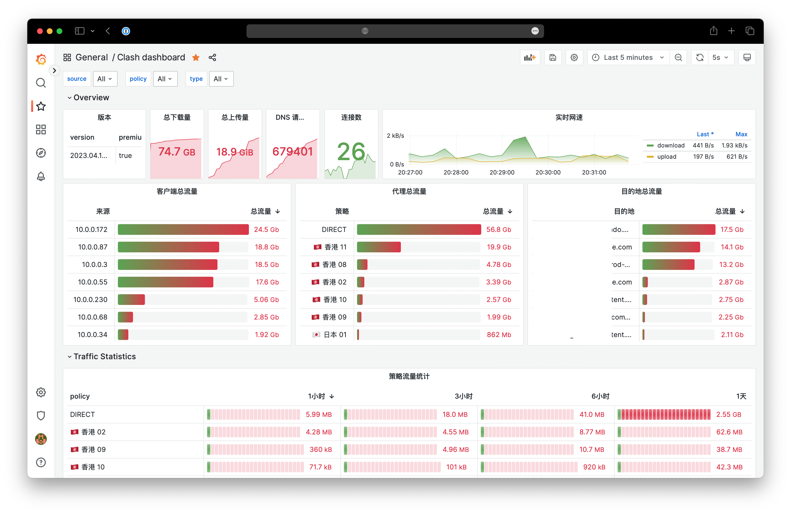
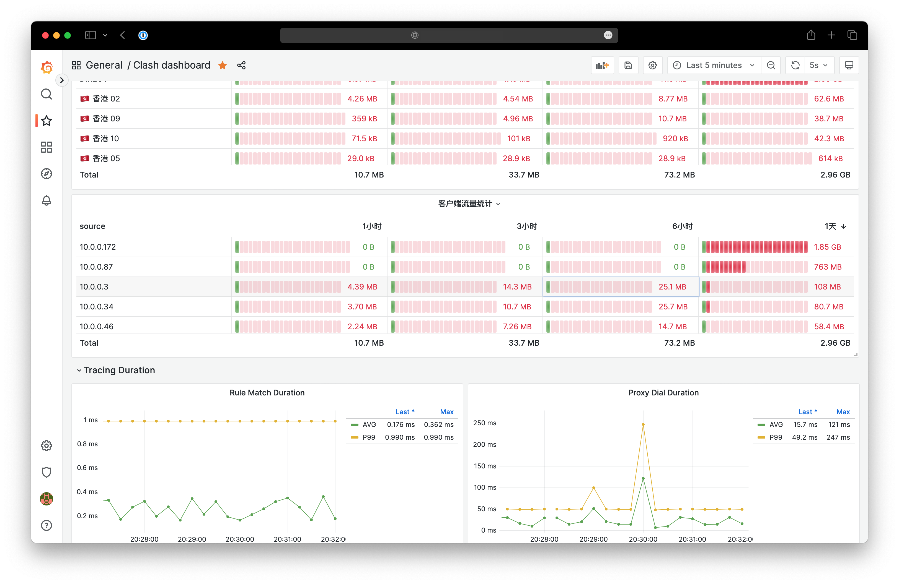

## Clash Exporter

This is an exporter for Clash, for used by the [Prometheus](https://prometheus.io/) to monitor clash network traffic.

<table>
<tr>
<td>

</td>
<td>

</td>
</tr>
</table>

### Usage

#### run in command

Go to https://github.com/zxh326/clash-exporter/releases download latest release binary file

```sh
➜  ./clash-exporter -h
Usage of ./clash-exporter:
  -collectDest
        enable collector dest
        Warning: if collector destination enabled, will generate a large number of metrics, which may put a lot of pressure on Prometheus. (default true)
  -collectTracing
        enable collector tracing.
        It must be the Clash premium version, and the profile.tracing must be enabled in the Clash configuration file. (default false)
  -port int
        port to listen on (default 2112)
```

#### deploy with docker compose

```sh
git clone https://github.com/zxh326/clash-exporter

# check docker-compose.yml and update environment
cat docker-compose.yml
docker compose up -d
```

visit `localhost:3000` and import [example dashboard](./grafana/dashboard.json) or via id `18530`

> tips: grafana default username / password is admin/admin

### Prometheus Example Config

```yaml
- job_name: "clash"
  metrics_path: /metrics
  scrape_interval: 1s
  static_configs:
    - targets: ["127.0.0.1:2112"]
```

#### Record Rule Config

```
groups:
  - name: discard_destination
    rules:
      - record: source_policy_type:clash_network_traffic_bytes_total:sum
        expr: sum without (destination, job) (clash_network_traffic_bytes_total)
```

### Grafana Example Dashboard

- You can import [clash-dashboard.json](./grafana/dashboard.json) to obtain the example effect, or you can create one yourself based on the following metrics introduction.

- or Import via [grafana.com](https://grafana.com/grafana/dashboards/18530-clash-dashboard/) with id `18530`

### Metrics

| Metric name                                     | Metric type | Labels                                                              |
| ----------------------------------------------- | ----------- | ------------------------------------------------------------------- |
| clash_info                                      | Gauge       | `version`, `premium`                                                |
| clash_download_bytes_total                      | Gauge       |                                                                     |
| clash_upload_bytes_total                        | Gauge       |                                                                     |
| clash_active_connections                        | Gauge       |                                                                     |
| clash_network_traffic_bytes_total               | Counter     | `source`,`destination(if enabled)`,`policy`,`type(download,upload)` |
| clash_tracing_rule_match_duration_milliseconds  | Histogram   |                                                                     |
| clash_tracing_dns_request_duration_milliseconds | Histogram   | `type(dnsType)`                                                     |
| clash_tracing_proxy_dial_duration_milliseconds  | Histogram   | `policy`                                                            |

### FAQ

- tracing metrics is empty

  - Required clash premium version
  - Follow [clash profile docs](https://github.com/Dreamacro/clash/wiki/Clash-Premium-Features#tracing) enable profile tracing
  - Add `-collectTracing=true` flag in clash-exporter start script

- high Prometheus Memory

  This may be caused by the default enable of collector destination traffic, which can generate a large number of metrics. Try use `-collectDest=false` disable it.

### TODO

- [x] dns query metrics
- [x] proxy dial metrics
